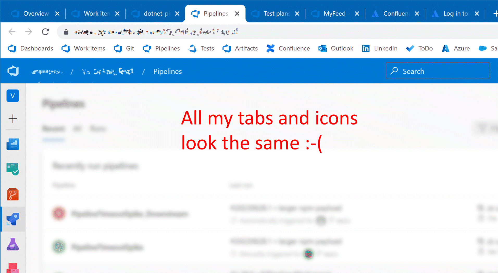

# Azure DevOps icons

[](https://github.com/wwestrop/AzureDevopsIcons/actions/workflows/main.yml)

**Find it at:** [Mozilla addons](https://addons.mozilla.org/en-GB/firefox/search/?q=Azure%20DevOps%20icon) or [Chrome webstore](https://chrome.google.com/webstore/detail/azure-devops-icons/pgbejjjgidgpciebpdiajlljpipdpcfe).

-----

Seemingly every website these days has a similar blue icon, making them all blur into one when your browser is overloaded with tabs and icons.

Azure DevOps is particularly bad as the site consists of several different areas, all of which share the same icon, making hunting for a tab a pain.



# Configuration

### For Chrome
There is one extension to install, it applies automatically to tab icons and bookmarks, and requires no configuration.

### For Firefox
After installing one of these extensions, Firefox will use the correct icon on tabs, but not on bookmarks.

To simulate bookmarks with appropriate icons, the extension is shipped as a set of six, one for each area of Azure DevOps, each with a toolbar button that acts as a shortcut to that area. You can customise the Firefox toolbar to move these buttons into the bookmark bar to simulate a saved bookmark.

Because it's not a true bookmark, you must configure each extension with the URL of your Azure DevOps instance. To do this: right click the toolbar icon -> `Manage Extension` -> `Options` -> `DevOps Homepage` (do this for each extension)

If you're using the extension only for the tab icons only, then you only need to install one extension (any of the six will do), and no configuration is required.

# Building
```
npm install
npm run build
```

# TODO
As a nice enhancement, I would like the pipelines tab icon to show whether a build is running, succeeded, or failed so you can monitor it in the background.
