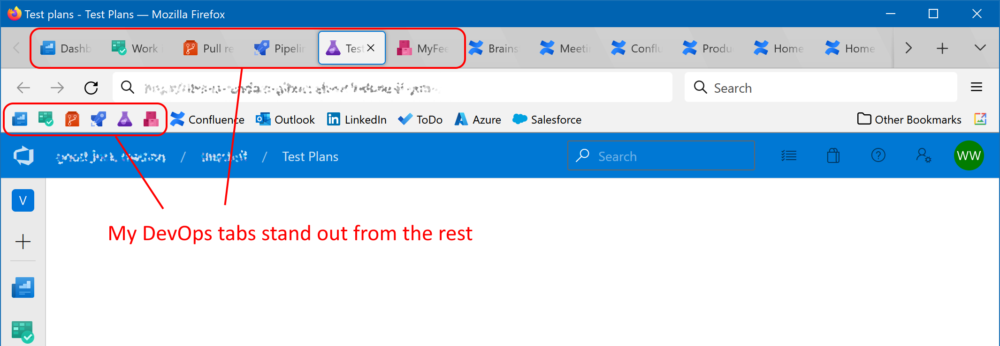

# Azure DevOps icons

Seemingly every website these days has a similar blue icon, making them all blur into one when your browser is overloaded with tabs and icons.

Azure DevOps is particularly bad as the site consists of several unrelated modules, all of which share the same icon, making hunting for a tab a pain.


This set of browser extensions for Firefox gives each tab a distinct icon to help you more easily distinguish what you're viewing.



It also adds a button to the toolbar with corresponding icon as a shortcut to each area on Azure DevOps. You can edit the toolbar and drag these onto the bookmarks bar with your other shortcuts.

# Configuration
If using the shortcut buttons, you will need to configure the extension with the base URL of your Azure DevOps site (done via the extension configuration screen in the browser). Each shortcut button is a separate extension and this configuration step needs to be done for every button you install.

If using the extension only for the tab icons and not the buttons, then no configuration is required, and you only need to install one extension.

# Building
```
npm install
```

## Firefox
```
node ./build.js
```

## Chrome
```
node ./build-chrome.js
```

# TODO
As a nice enhancement, I would like the pipelines tab icon to show whether a build is running, succeeded, or failed so you can monitor it in the background.
